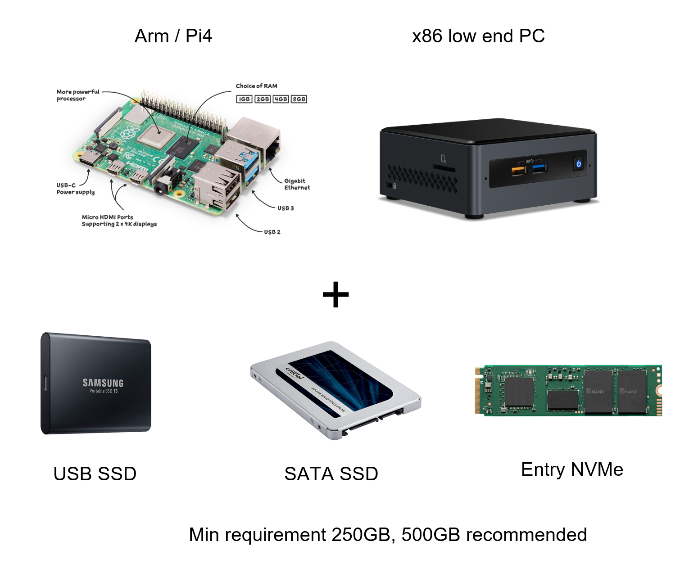

# Full Node

Full node. The full node in the Chia is the peer-to-peer protocol that contains actually syncing the blockchain. Chia uses Nakamoto consensus, which means the network is permissionless, decentralized, and follows a Poisson distribution for inter-blocktime arrival. The full node requirements are designed to be extremely low, since the proof of space verification is very lightweight. It is designed to run on low-power, low core-count commodity computing devices (e.g. cheap laptop, Raspberry pi4.) There is a small-capacity SSD requirement to house the database for the blockchain, which is not a problem since a 256GB is currently cheaper than the cheapest HDD [IDC, 2021]. Chia has profiled the blockchain database workload to not take up a considerable amount of storage space and fit on a mainstream SSD included in every laptop, desktop, or easily available in the global consumer SSD market which includes 360 million SSDs per year [IDC, 2021].

Measured data

* Database size after 1827815 blocks (~13 months): 56.13GiB / 60.28 GB
    * In 5 years database size will be 277GB at current compression, opportunity to reduce by another 20-30%
* Database writes (sqlite) measured over normal transaction volume, blocks on average 30% full
    * 472KiB/s database writes, 41.78 GB/day, 15.25 TB written per year
* SSD selection & endurance
    * 250GB low end consumer SSD ($25) has 150TBW, last 5 years
    * 500GB consumer SSD (~$40) has 300TBW, last 10 years

Figure: Full Node Requirements
