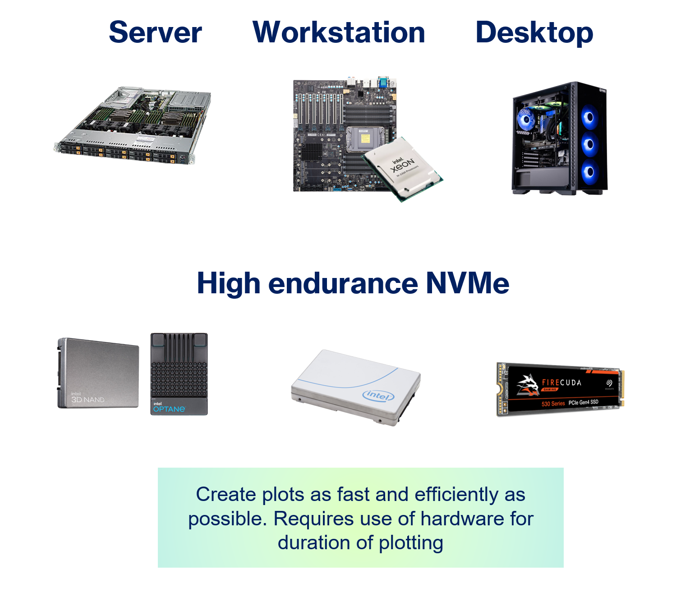

# Plotting
The Chia plotting workload is only required to be performed once per plot during the initial creation, where the final plot file lives on a low power storage device for the remainder of the years of farming. The [plotting](https://www.chia.net/2021/02/22/plotting-basics.html) process involves the creation of the cryptographic data that is stored on the farming devices, and requires compute and ephemeral storage resources to create. Plotting is a one time energy consumption use per the total Netspace, as the data to be stored for farming only needs to be created once. More details about the plotting process can be found in the [Chia Proof of Space Construction](https://www.chia.net/assets/Chia_Proof_of_Space_Construction_v1.1.pdf) document. The Chia community has [reference hardware posted ](https://github.com/Chia-Network/chia-blockchain/wiki/Reference-Plotting-Hardware)with the amount of data that various machines can plot per day, and the average power consumption of the systems can be measured or estimated very accurately (since these are common consumer or server platforms). Users also record the amount of data they are able to plot per day per machine making it practical to estimate the energy consumption to create the Chia plots, estimated in kWh/TiB plotted. A k=32 plot is expected to live for at least a 5 year period, and thus the energy required to create the plot is amortized over the life of the plot. The total power consumed to plot the entire Netspace can be estimated using the range of reference hardware, then divided by the number of years for the average energy consumption contribution in the network coming from plotting. Although plotting systems consume real power to operate, the contribution to the total annual energy consumption is 20-30x lower than the actual power consumed by the storage devices for farming. Current fast Chia plotters can produce 1TB of plots with as little as 0.4kWh of electricity.

Figure: Common hardware elements for Chia Plotting
