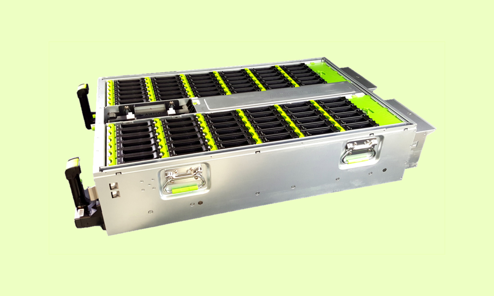

The Chiapower model observes Netspace growth, industry analyst reports, and first-hand reporting directly from the HDD vendors on the capacity mix for HDDs attributed to Chia. The total power consumption on the Chia network can be estimated by taking the total Netspace (similar to hashing power in bitcoin) and modeling the power consumption of the storage devices (farming) and the energy consumed to create the data (plotting). This is a similar methodology to the [Cambridge Bitcoin Electricity Consumption Index](https://cbeci.org/), where most likely mining hardware is known, and electricity cost is estimated, and the total power consumption of the bitcoin network is estimated using a low and high estimate of reference mining hardware. Estimating a mix of common reference hardware farmers using hard disk drives (HDDs) and solid state drives (SSDs) by what is economical for Chia farming will depend on the capital expenditures of the hardware (CapEx) and operational expenditures for power, cooling, networking, and data center efficiency. Storage power efficiency is measured in TB/W which includes the overhead of the supporting hardware infrastructure to host the storage devices, but the largest upfront cost in Chia farming is the cost of the storage devices themselves. The Chia network also consumes energy during the plotting process, wherein the cryptographic data is generated prior to being able to farm for the proof of space and time.

Energy consumption in kWh can be calculated by assuming an estimated percentage of the network using consumer hardware with spare capacity (underutilized resources already owned), which happen to be very efficient due to the transition in mainstream computing devices to SSDs over the last decade, as well as the percent of dedicated farmers that are using dense storage configurations with data center grade equipment.

### Summary of equations

$P_h (MW) = (Netspace (EiB) \times (1024^6) / (1000^4)) \times (TB/W_h / 1000^2) \times \% Netspace \space high-cap$

$P_l (MW) = (Netspace (EiB) \times (1024^6) / (1000^4)) \times (TB/W_l / 1000^2) \times \% Netspace \space low-cap$

$P_u (MW) = (Netspace (EiB) \times (1024^6) / (1000^4)) \times (TB/W_u / 1000^2) \times \% Netspace \space underutilized$

Where TB/W for the different segments are estimated with the representative farming equipment efficiency, summing the power of the storage with an estimate of power consumption in the Chia farming workload with the supporting infrastructure, dividing it by the total amount of usable terabytes (TB), with an overhead of the power usage effectiveness or efficiency. PUE (Power Usage Effectiveness) is estimated at 1.1, consistent with the best guess from [CBECI ](https://cbeci.org/cbeci/methodology)to compare to Bitcoin

$TB/W_h = PUE \times TB/rack \div P_s \space storage + P_r \space rack$

Total power of the Chia network

$P_T = P_h + P_l + P_u$

Annual energy consumption

$E_A \space Annual \space Energy = \displaystyle\sum_0^1 \space P_T \times 24 \times 365 + ((Netspace \space TiB) \times P_p \space plot \space kWh/TiB \space plotted) \div 5 \space years)$

Phase 1 growth of Chia was dominated by high capacity nearline HDDs, coming from both the retail channel and distributors in the enterprise space. The timing of the Chia first transactions was around 6 weeks after mainnet launch on March 19, 2021, the Bitcoin all-time high being in April 2021, a small number of coins in the market coming only from early farmers, and some early IOU trading led Chia to launch at a high price in the first few weeks of trading. This presented a large opportunity for early farmers while the Netspace and difficulty of the network was low causing a large amount of high-capacity new HDDs to be purchased to farm Chia. The average capacity estimates were above 14TB. Below is the estimate of shipments for the nearly 1ZB of nearline HDDs shipped in 2021 per Gartner, corroborating the reports in sales, HDD ASP (pricing), and reports directly from the HDD vendors.

<iframe width="600" height="371" seamless frameborder="0" scrolling="no" src="https://docs.google.com/spreadsheets/d/e/2PACX-1vQTo_q1WX68ONeRJZuHsdueYfgv71o3qmrXCwNQ-UScBSmLuHI781iRMXpsVntueyI2-DpS_PHpK6oK/pubchart?oid=1545311890&amp;format=interactive"></iframe>

Source: Gartner “Forecast: Hard Disk Drives, Worldwide, 2017-2024”

We use a representative farming model, which we will go into detail, that includes equipment required to host dense storage deployments. This includes the rack, JBODs (storage array), cables, management servers, and supporting equipment. The power of the storage is still the dominant power utilization in Chia farming, but the supporting equipment needs to be modeled. The goal in Chia farming is to be as efficient as possible to reduce operational expenditures, so we assume farmers are indeed optimizing for cost and power.

| Parameter                   | Description                                                        | Unit            | Source                                                                                                             |
| --------------------------- | ------------------------------------------------------------------ | --------------- | ------------------------------------------------------------------------------------------------------------------ |
| Netspace                    | The total amount of farming capacity on the Chia network           | EiB (Exbibyte)  | Chia network, Chia explorer                                                                                        |
| Plotting energy consumption | Average energy consumption to create plots                         | kWh/TiB of data | Chia community [reference hardware](https://docs.google.com/spreadsheets/d/14Iw5drdvNJuKTSh6CQpTwnMM5855MQ46/edit) |
| Device power consumption    | The idle power of the storage device                               | W/TB            | Modeled by device type for SSD and HDD                                                                             |
| Power high-cap              | Take average capacity of nearline HDDs being used for Chia farming | Megawatt (MW)   | Gartner, IDC, HDD vendors                                                                                          |
| Power low-cap               | Using recycled or used HDDs                                        | Megawatt (MW)   | assume 5 years old, an average of 4-8TB                                                                            |
| Power underutilized         | Coming from consumers with underutilized storage capacity          | Megawatt (MW)   | IDC on Chia                                                                                                        |

## Power consumption for large capacity

The majority of nearline and high capacity HDDs are consumed by hyperscale data centers and large cloud service providers, where designing around lowest possible data center TCO is the ultimate goal. TCO is measured in TCO$/TBe/rack/month, where TCO is the sum of the total capital and operational expenditures amortized of the effective or usable capacity of the storage system. The Chia power model utilizes a similar model assuming the most efficient way to store data is already widely being used.  Optimizing disk storage TCO involves getting the highest capacity HDDs, which offer the highest energy efficiency in terms of TB/W, as well as densely packed JBODs (just a bunch of disks) measured in TB/rack unit. Different architectures for warm storage (more frequently accessed) vs cold storage (archival, less frequently accessed) vary mostly around the amount of compute to storage ratio. Chia farming looks very similar to hyperscale HDD archival storage requiring minimum compute resources and networking resources for the actual harvester and farming protocols. Hyperscalers like [Facebook](https://www.usenix.org/conference/fast21/presentation/pan) and Microsoft have written about their storage systems extensively because the [JBOD hardware designs](https://www.opencompute.org/documents/facebook-bryce-canyon-storage-system-specification) are open source at the [Open Compute Project](https://www.opencompute.org/).

The model used to estimate power consumption for disks and supporting infrastructure is taken from the [SNIA open source storage TCO model](https://www.snia.org/forums/sssi/programs/TCOcalc). Replication, erasure coding, and RAID for data protection is not assumed for use in the Chia farming model, due to the fact that plot data can be easily recreated upon disk failure. The model also assumes the majority of disk time is spent in active idle, where the motor is spinning and the disk can respond to commands in milliseconds. The total power consumption overhead for dense storage involves a storage server (or sometimes called headnode) that serves the operating system hosting the Chia harvester and/or farmer. The total power consumption must include the JBODs (which power consumption comes mostly from the disks, but some from the fans, SAS expanders, and backplane) and the servers and supporting infrastructures like networking routers and switches. Everything that is in the rack dedicated to Chia farming must be considered to accurately model the power consumption efficiency in TB/W. While Chia farms may not look exactly like a hyperscale rack, the goals are identical.

**store the largest amount of data in the smallest amount of space with the lowest power**

To achieve this goal, high-capacity HDDs must be used due to the large advantage of capacity per rack unit and physical space and power per TB.

### Energy efficiency - Data center PUE

Hyperscalers like [Facebook](https://tech.fb.com/hyperefficient-data-centers/) have achieved a world-class PUE of 1.08 and have a large effort in [sustainability](https://sustainability.fb.com/) and renewable energy. We assume most large farmers in the first few years are not optimizing for maximum power efficiency, but just like in Bitcoin over time the power efficiency will gravitate towards the most efficient solutions for power consumption, low cost electricity, and energy efficiency. For this model, we have assumed a mid-range best guess estimate consistent with the [CMECI methodology](https://cbeci.org/cbeci/methodology) to ensure a consistent comparison. There will certainly be a large range of efficiencies with Chia farmers.

## Power consumption low-cap

The power consumption in the Netspace coming from low capacity HDDs (the majority being in the 4-8TB range) consume higher power per TB than high capacity HDDs, but come at a lower acquisition cost. Hard disk drives also exhibit a bathtub curve for device failures when power on hours exceeds the 5-year warranty or excessive writes to the disk (HDD manufacturers call rated workload). The annual failure rate for these models that are well into production has been well documented, with reports like [Backblaze HDD Disk Stats](https://www.backblaze.com/b2/hard-drive-test-data.html). Through research on hyperscale HDD recertified programs, most likely the failure rate over time increasing is being caused by increased use. The Chia workload is very lightweight, and read-only once the data is on the farming medium. This is expected to spur a large amount of interest in recertified or recycled hard drives for us in Chia farming. Chia is also not storing any user data, so the occasional bit error is not actually catastrophic for farming, it just effectively compromises a small number of proofs (of which there are many millions in a single plot file).

The power estimation for low-cap assumes a weighted average of 4TB, 6TB, and 8TB used in mainstream desktop farms, with relatively low overhead and the assumed best guess PUE of 1.1 above.

## Power consumption for underutilized storage - Phase 2 growth

In June of 2021 IDC released the report on Chia, titled Chia Cryptocurrency Farming Is Real and Uses Lots of Storage. Bram Cohen, CEO and founder of Chia Network, had a hypothesis when he started Chia that there was a large amount of underutilized storage in the world, and this storage could be used to secure the network for the Chia blockchain using proof of space and time. IDC confirmed this hypothesis.

“IDC believes that consumer-owned DT PCs and PS devices equipped with HDDs do represent a nearterm addressable TAM for storing Chia plots. IDC's Global StorageSphere research indicates that, in CY21, approximately 195EB of available storage capacity exists in the installed base of consumer DT PCs, plus roughly 310EB of storage capacity is available in the installed base of HDD-based consumer PS devices.”
Source: IDC Market Perspective - Chia Cryptocurrency Farming Is Real and Uses Lots of Storage

Important stats used for modeling the power use for underutilized storage
Desktops - PCs using internal HDDs in desktops are only utilizing on average 30% of the hard drive.
External HDDs - PCs with an external HDD attached are only utilizing on average 23% of the hard drive.
These stats are used for the contribution of underutilized storage to the power consumption in the Chia netspace.
The expectation is that with pooling, this storage becomes unlocked for the smaller farmers who wanted to participate in the network but would not have been earning frequent rewards with the large Netspace growth that occurred during Chia phase 1 growth. We expect a large amount of growth in phase 2 to be driven by underutilized storage space. While we will see accelerated HDD demand in response to a large increase of the price of XCH, the marginal cost of the people who already own storage to start farming Chia is very small. With the energy use to farm being very low, and pools being very accessible, this will create the perfect environment for smaller farmers with underutilized space to farm on the Chia network.
In phase 2 growth we estimate a percentage of the network growth coming from underutilized storage based on the price and ROI for Chia farming. The current estimate does not reflect any hard prediction, just used for modeling purposes. We will observe over the next few months
