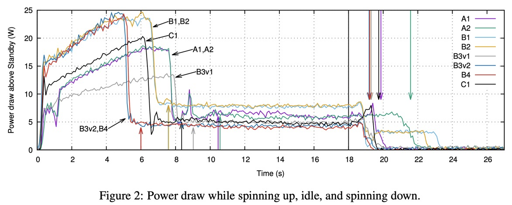

# Power Requirements for Hard Drives

The Chia farming process is [very lightweight](https://docs.chia.net/docs/15resources/Storage_farming), requiring very little disk io by only having to perform a [proof quality check](https://docs.chia.net/docs/03consensus/proof-of-space/#farming) on most lookups, and through a mechanism called the plot filter which reduces the io by a factor of the constant. In Chia the plot filter is currently set to 512, meaning that on every challenge a plot has a 1/512 chance of being eligible. Although the amount of data transferred is very low, the frequency of data access depends on the size of the plots constructed and number of plots per drive (capacity per disk), measured with a K value, with the minimum K value = 32 consisting of ~108GB (~101GiB. Most farmers use the minimum required K value for the network operation due to the ease of plotting and the disk is accessed frequently, but still only transfers a small amount of data. These parameters dictate power savings depending on the device type used for farming since SSD and HDD have very different power states and latency profiles.

The power consumption of storage devices is well understood. Hard drives save power in a few ways. Consumer hard drives sometimes have a lower RPM (5400) vs enterprise or nearline HDDs (7200 rpm), which decreases power consumption from spinning the motor slower. When an HDD is idle for an extended period of time, the device can enter a lower power state by disabling the servo systems, parking the head, or spinning down. One cycle of parking the head is called a load/unload, which has a limited amount of times it can be performed over the duration of an HDD deployment due to the mechanical wear and tear. This power state is called Idle B.

Analysis has shown that during the Chia farming workload on an 18TB HDD with n=165 plots, the HDD was idle 99.7% of the time (Source: Western Digital, Seagate, [Chia](https://docs.chia.net/docs/15resources/Storage_farming)). The power consumption for Chia farming can be found on the hard drive specification for idle power under Idle A. In this power state, the hard drive motor is spinning with the heads on track follow and some of the servo systems may be disabled.

| Drive Model                                                                                                                                                                                                                             | Rotational Speed | Idle A power (W) |
| --------------------------------------------------------------------------------------------------------------------------------------------------------------------------------------------------------------------------------------- | ---------------- | ---------------- |
| [Western Digital HC550 18TB](https://documents.westerndigital.com/content/dam/doc-library/en_us/assets/public/western-digital/product/data-center-drives/ultrastar-dc-hc500-series/product-manual-ultrastar-dc-hc550-sata-oem-spec.pdf) | 7200 rpm         | 5.6W             |
| [Seagate Exos X18 18TB](https://www.seagate.com/files/www-content/about/newsroom/media-kits/_shared/files/exos-x18-channel-DS2045-1-2007US-en_US.pdf)                                                                                   | 7200 rpm         | 5.3W             |
| [Seagate Barracuda Compute 8TB](https://www.seagate.com/www-content/datasheets/pdfs/3-5-barracudaDS1900-11-1806US-en_US.pdf)                                                                                                            | 5400 rpm         | 3.4W             |

There are advanced techniques that can be used with varying the number of plots per drive (using a higher value for k, increasing the plot file size), and tuning the timer for Idle B. It is not recommended to spin down the drive due to the time it takes and energy consumed to spin up the drive, which can be 15-20 seconds on mainstream and enterprise HDDs.

To get to zero idle power, the drive must actually spin down. While it is technically possible for a hard disk drive to spin down to zero idle power between slots, the resume latency from HDD power off or spindown is 10 seconds and HDDs consume higher power to spin up (inrush current) reaching up to 25W for a few seconds. The energy consumed for power up and the mechanical wear and tear on the device make it not practical to spin down the drives in regular use. Power savings on the other mechanical aspects of HDDs, for instance, management of the heads and actuators, are device-specific, while link power states are subject to the host storage interface (both SAS and SATA have detailed power state machines that operate differently)

Because of the nature of the moving parts within the HDD, repeated movements and friction over hundreds of thousands of iterations can cause physical particles to be released within the hard drive, and increase the chance of physical damage on the disk. The current assessment is that despite a large amount of idle time on the disk and using standard k=32 plots, the disk is being accessed frequently enough (albeit a small amount of data actually being read) that parking the heads or spinning down would cause an accelerated amount of wear and tear on the drive that would be detrimental to the longevity and reliability of the HDD.

Source: [Feeding the Pelican: Using Archival Hard Drives for Cold Storage Racks](https://www.microsoft.com/en-us/research/publication/feeding-pelican-using-archival-hard-drives-cold-storage-racks/)
