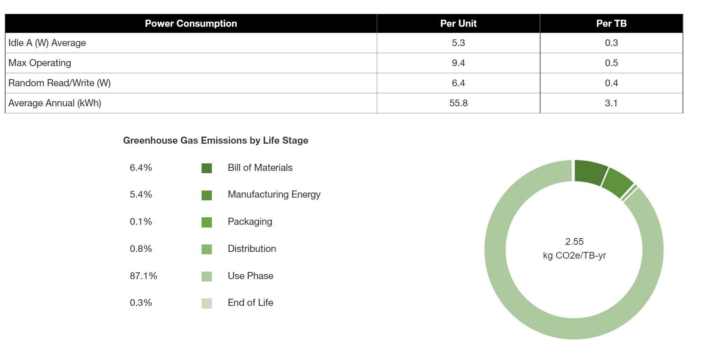
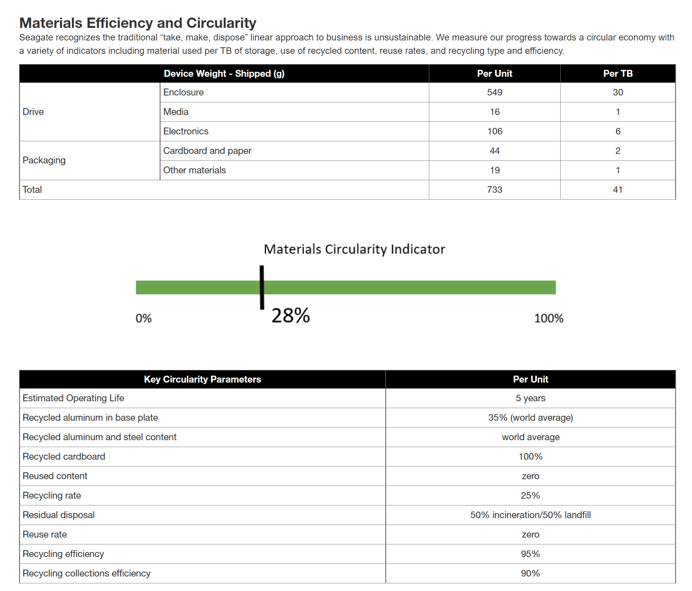

# LCAs

The major vendors for hard disk drives, Seagate, Western Digital, and Toshiba, are publicly traded companies and release annual sustainability reports, and ESG data on their products. Requirements for companies to report emissions are increasing and storage vendors are being more transparent in providing LCA (Life Cycle Assessment) for various products.

Figure: [Example LCA from Seagate Exos x18 Hard Disk Drive](https://www.seagate.com/global-citizenship/product-sustainability/exos-x18-sustainability-report/)

There is a call to action for the [entire ICT industry](https://www.opencompute.org/documents/ocp-sustainability-2021-industry-whitepaper-pdf) to be more sustainable, increasing energy efficiency and moving to circular business models. Technology providers, cloud service providers, hyperscale data centers, OEMs, and enterprise storage are part of the Open Compute Project, which in addition to releasing open hardware and software has an increasing focus on sustainability, including industry-standard [LCA for OCP companies](https://www.opencompute.org/documents/lca-sop-in-ocp-document-submission-template-docx-pdf).

Hard drive [value recovery](https://www.sciencedirect.com/science/article/abs/pii/S0921344921003037 http://thor.inemi.org/webdownload/2019/iNEMI-Value_Recovery2_Report.pdf), supply chain, and carbon impact have been well studied, including the reuse of component subassemblies in HDDs that contain rare earth magnets.

[https://doi.org/10.1557/mre.2020.21](https://doi.org/10.1557/mre.2020.21)
[https://doi.org/10.1016/j.resconrec.2021.105694](https://doi.org/10.1016/j.resconrec.2021.105694)
[https://doi.org/10.1016/j.resconrec.2020.104781](https://doi.org/10.1016/j.resconrec.2020.104781)
[Older studies ](http://www.designlife-cycle.com/harddrives)exist but have limitations compared to new LCA reporting.

The reporting models for circular business models are still emerging, as vendors are trying to figure out the best practices around conducting LCAs on reuse, recertified, and recycled products. There are standard metrics like the Materials Circularity Indicator (MSI), but new models are being developed in workgroups like the [Circular Drive Initiative](https://circulardrives.org/).

