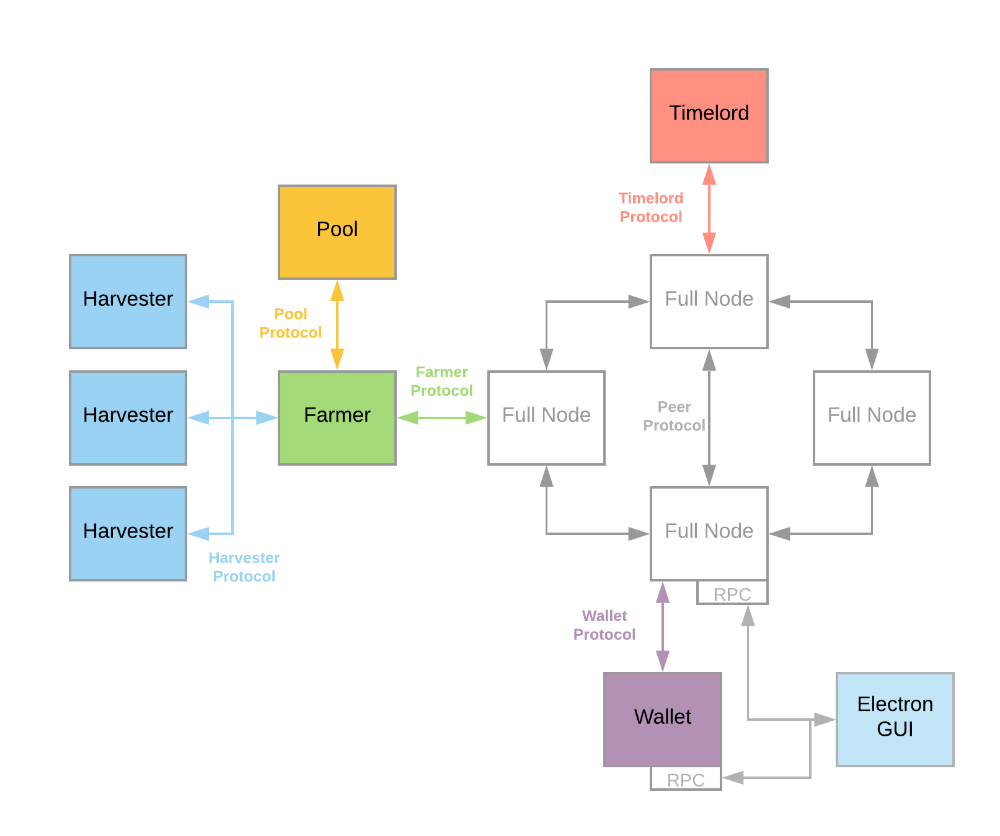

# Proof of Space and Time

Chia uses a consensus called proof of space and time, in which participants prove to the network that they are storing a certain amount of data through a process called farming. Proofs of space must be generated in a process called plotting, which is defined in the[ Chia proof of space construction document ](https://www.chia.net/assets/Chia_Proof_of_Space_Construction_v1.1.pdf)and first introduced in [Beyond Hellman](https://eprint.iacr.org/2017/893.pdf).

Proof of Space has two main components, plotting and farming. Plotting is the proof of space generation phase, where a user creates a "plot file" that requires an upfront one-time use of computational resources, so that proofs can be quickly and easily verified later. The plotting process can’t be too easy or the protocol would completely devolve into proof of work, but the key is that it only has to be done once (instead of proof of work, where new hashes need to be found between every block or challenge). On a standard desktop PC the plotting process can take between 30 minutes and an hour, which is a tiny portion of the life of a plot which can be many years.

The actual consensus revolves around the process of "farming". Farmers compete to create blocks when a proof of space is found that meets the challenge requirements. The higher amount of storage space a farmer has, or more plot files consuming more actual storage space, measured in bytes (e.g. terabytes, petabytes). This storage "space" is equivalent to hashing power in the network, and the total space in the Chia network is referred to as Netspace.

## Terminology

Chia architecture can be found [here](https://docs.chia.net/docs/02architecture/p2p-system).

- **Plotting** - creating the proofs of space into a "plot file" requires upfront one-time use of compute resources, so that proofs can be quickly and easily verified later.
- **Harvesting** - the harvesters are individual machines controlled by the farmer that continuously and unintrusively check the plot files for proofs of space.
- **Farming** - farmers compete to create blocks when a proof of space is found that meets the challenge requirements.
- **Full node** - maintains an entire copy of the blockchain, propagates blocks, transactions, and proofs between peers.
