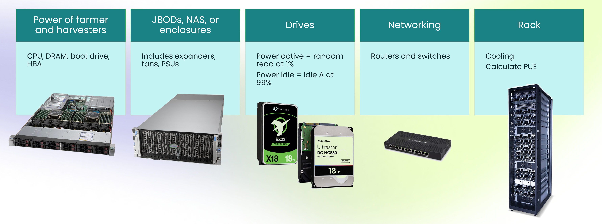

# Rewards
Rewards minus the costs determine chia farming profitability. The expected value of the rewards has inputs of the farmer's raw space, the compression level chosen, calculating the effective farming space, and dividing it by the Netspace in the same units.

Plot Constant Factor = 0.78

Effective capacity = number of plots * Plot Constant Factor * ((2 * k) + 1 ) * (2 ** (k - 1))

For K=32, the most common value in Chia, the effective capacity is
Effective capacity = Number of plots * 108.8 GB
Effective capacity = Number of plots * 101.3 GiB

Rewards per day = Effective capacity in GB * (1000^4) / (Netspace in EiB * 1024^6) * reward blocks per day * block reward - fees

Fees can be developer fees for plotting software or pool fees

A farmer can easily estimate how much XCH they will earn based on their farming capacity and current Netspace. The farming TCO model, which can also be found at [https://chiacalculator.com/roi](https://chiacalculator.com/roi), is the complete picture for all the total cost of ownership for Chia farming, as well as the expected rewards that require an estimate of Chia Netspace and price. The main inputs to the TCO model are a profile of the HDDs being used, including cost and power, as well as the supporting infrastructure for farming (JBODs, servers, networking, cables, desktops, etc.). The TCO model depends on how many years to depreciate the hardware for farming over, and what the residual value will be. In Chia farming, the capital expenditures and upfront costs of the HDDs make up a large percentage of the TCO - 89% in a mid-range farm with USA home electricity costs.

The upfront costs of storage make up the majority of the cost for Chia farming.

# TCO Model
Source: [Chia Farming Total Cost of Ownership Model](https://docs.google.com/spreadsheets/d/1k6c-OBDtggXqnEfOPdMmq3646puzvOD7dWojwCH2v3c/edit?usp=sharing)

Figure: Common hardware elements for Chia farming